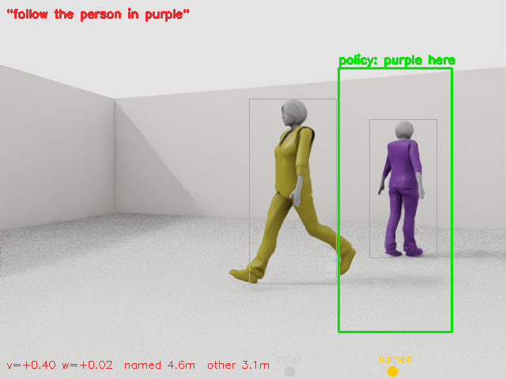

# MiR + YOLO + VLA — follow the person the instruction names

A MiR100 in Isaac Sim follows one of two people who differ **only** in the colour
of their clothes. The instruction is `follow the person in purple` or
`follow the person in yellow`, and it switches twice inside every episode. YOLO
finds the people, a finetuned **SmolVLA** reads the instruction, decides *which*
person to follow, and drives the robot.

The policy never receives anyone's position. Ground truth is used by the scripted
expert while collecting data, and for scoring afterwards — never as a model input.



*Green: where the policy itself says the named person is. Grey: YOLO's detections.
Dots on the bottom edge: where each person really is. 45 s clip in
[`media/box_overlay.mp4`](media/box_overlay.mp4).*

---

## 1. How the pieces fit

```
platform camera 640x480
        |
        v
  person_crops.py  (YOLO11n + ByteTrack)
        |
        +--> marked frame  --> observation.images.camera1  -+
        +--> left crop 512 --> observation.images.camera2   |--> SmolVLA --> [v, w]
        +--> right crop512 --> observation.images.camera3  -+      ^
                                                                  |
  /scan -> 24 min-pooled sectors --> observation.state            |
  "follow the person in purple" ----------- task ------------------+
```

YOLO does perception (detect, crop, draw); the VLA does the instruction-conditioned
choice and the control. Crops are sorted **left to right**, never by track id — ids
are issued in order of first appearance, so the target would land in the same slot
far more often than chance and the policy could learn the slot instead of the words.

Crops exist because of resolution: SmolVLM2 splits a 512x512 input into 1024
patches and a person at following distance occupies 1–7 of them. Blown up to full
size, one person carries 70,000–120,000 saturated pixels of a single colour.

---

## 2. What you need

Tested on exactly this; other versions may work but were not tried.

| | |
|---|---|
| GPU | NVIDIA RTX 5090, 32 GB (driver 580.173.02). Training uses ~10 GB, Isaac ~4 GB, the policy server ~1.7 GB |
| OS | Ubuntu 22.04 with Docker and the NVIDIA container toolkit |
| Isaac Sim | 5.1.0.0 in its own conda env, Python 3.11 |
| Training / inference | conda env with Python 3.11, torch 2.10.0+cu128, lerobot 0.4.4 (see `vla/requirements.txt`) |
| ROS 2 | Humble, **inside a container** — not on the host |

The split matters: Isaac Sim ships Python 3.11, Humble's `rclpy` is built for
3.10, and lerobot needs torch. Nothing sane installs all three in one environment,
so this repo keeps three and lets them talk over localhost HTTP.

---

## 3. Install

### 3.1 Isaac Sim environment (host)

```bash
conda create -n env_isaaclab python=3.11 -y
conda activate env_isaaclab
pip install isaacsim==5.1.0.0 isaacsim-kernel==5.1.0.0   # plus the extension wheels Isaac asks for
export OMNI_KIT_ACCEPT_EULA=Y      # put this in the env, see troubleshooting
```

### 3.2 Training / inference environment (host)

```bash
conda create -n env_lerobot python=3.11 -y
conda activate env_lerobot
pip install -r vla/requirements.txt
```

`ultralytics` downloads `yolo11n.pt` on first use; `lap` is what ByteTrack needs.

### 3.3 ROS 2 container

```bash
docker run -d --name my_isaac_sim \
  --network host --gpus all \
  -v /tmp/.X11-unix:/tmp/.X11-unix \
  -v /usr/share/vulkan/icd.d:/usr/share/vulkan/icd.d:ro \
  osrf/ros:humble-desktop sleep infinity
```

Inside it you need:

- `/root/ros2_ws` with `mir_robot`, `ira_laser_tools` and `twist_stamper` built
  (`colcon build`), which provide the description, the controllers and the laser
  merger that publishes `/scan`
- `/root/fastdds_udp_only.xml` — a FastDDS profile that forces UDP. Without it,
  shared-memory discovery across the host/container boundary is unreliable
- `/root/vla` — copy the scripts that run inside the container:
  `runner_2p.py`, `follow_expert.py`, `record_episode.py`, `gt_pose_pub.py`,
  `grab_image.py`, `tuck_arm.sh`

```bash
docker cp vla/runner_2p.py my_isaac_sim:/root/vla/      # and the rest
```

`--network host` is what lets the container reach the policy server on the host at
`172.17.0.1:8770`.

### 3.4 Assets and scene

You need a rigged character USD (this project used `F_Business_02.usd`) and then:

```bash
conda activate env_isaaclab
python isaac_sim/gen_follow_scene_2p.py --out scenes/follow_room_2p_v2.usd \
    --person /path/to/F_Business_02.usd
```

That builds a 16 x 12 m room with two people, one tinted purple and one yellow.
Useful variants: `--swap-colours` (exchange the two), `--wear yellow=red` (dress one
in an unseen colour), `--no-tint`.

### 3.5 Paths you MUST change

The scripts were written for one machine and hardcode it. Before running anything,
edit these:

| what | appears in | current value |
|---|---|---|
| Isaac conda python | `vla/launch_2p_*.sh` | `/home/itri/anaconda3/envs/env_isaaclab/bin/python` |
| lerobot conda python | `vla/train_*.sh`, `vla/regen_*.sh` | `/home/itri/anaconda3/envs/env_lerobot/bin/python` |
| simulator directory | `vla/launch_2p_*.sh` | `/home/itri/mir_isaac_test/mir_robot/isaac_sim` |
| working directory | `vla/*.sh` | `/home/itri/mir_isaac_test/vla` |
| scene file | `vla/launch_2p_*.sh` | `/home/itri/mir_isaac_test/scenes/follow_room_2p_v2.usd` |
| FastDDS profile (host side) | `vla/launch_2p_*.sh` | `/home/itri/mir_isaac_test/fastdds_udp_only.xml` |
| results directory | `vla/eval_closed_loop.sh`, `vla/launch_2p_*.sh` | `/home/itri/mir_isaac_test/vla/results_2p` |
| container name | most scripts | `my_isaac_sim` |
| server address | `vla/eval_closed_loop.sh` | `172.17.0.1:8770` |

---

## 4. Running it end to end

Timings are from an RTX 5090; the simulator runs about 2.5x slower than wall
clock, which is why the numbers look large.

### 4.1 Start the simulator and the ROS stack — in this order

```bash
bash vla/launch_2p_drive.sh                      # Isaac; wait ~100 s

docker exec -d my_isaac_sim bash -c '
  source /opt/ros/humble/setup.bash
  source /root/ros2_ws/install/setup.bash
  export FASTRTPS_DEFAULT_PROFILES_FILE=/root/fastdds_udp_only.xml
  ros2 launch mir_description mir_isaac.launch.py launch_moveit:=false launch_rviz:=false'

docker exec my_isaac_sim bash /root/vla/tuck_arm.sh        # AFTER the controllers
docker exec -d my_isaac_sim bash -c '
  source /opt/ros/humble/setup.bash; python3 /root/vla/gt_pose_pub.py'
```

Check before going further:

```bash
docker exec my_isaac_sim bash -c 'source /opt/ros/humble/setup.bash;
  timeout 25 ros2 topic hz /joint_states'          # must show a rate
docker exec my_isaac_sim bash -c 'source /opt/ros/humble/setup.bash;
  timeout 25 ros2 topic info /scan | grep Publisher'   # must be exactly 1
docker exec my_isaac_sim bash -c 'cd /root/vla &&
  python3 grab_image.py /platform_camera/color/image_raw /root/check.png'
```

The last one should show two people and **no robot arm** in frame.

### 4.2 Collect demonstrations (~3 h for 25 episodes)

```bash
python3 vla/collect_2p_move_sw.py --out raw_msw_all -n 25
```

Each episode: the scripted expert follows one person, the instruction switches
twice, and the recorder logs camera, `/scan`, actions and both people's poses.
Episodes where the robot tipped are marked failed and skipped later.

### 4.3 Convert (~10 min)

```bash
bash vla/regen_mswall_box_dataset.sh     # runs YOLO over every frame
```

This produces `lerobot_mswall_box` (train) and `..._val` (10 held-out episodes).
`--box-action` adds the four box coordinates and a visibility flag to the action,
labelled from the detections plus the recorded ground truth. Drop that flag
(`vla/regen_mswall_dataset.sh`) for a plain 2-dim action.

### 4.4 Train (~60 min for 30k steps)

```bash
bash vla/train_mswall_box_vla.sh
```

SmolVLA finetuned from `lerobot/smolvla_base`, batch 4, chunk 50,
`n_action_steps` 10. Checkpoints land in `train/smolvla_mswall_box/checkpoints/`.

### 4.5 Serve and drive

```bash
conda activate env_lerobot
python vla/policy_server.py \
  --ckpt train/smolvla_mswall_box/checkpoints/030000/pretrained_model \
  --crops --host 0.0.0.0
```

One episode:

```bash
docker exec my_isaac_sim bash -c 'source /opt/ros/humble/setup.bash
  export FASTRTPS_DEFAULT_PROFILES_FILE=/root/fastdds_udp_only.xml
  cd /root/vla && python3 runner_2p.py --server 172.17.0.1:8770 \
    --instruction "follow the person in purple" --target purple --other yellow \
    --seconds 70 --warmup 25 --drive --max-accel 1.0 --true-front \
    --cam-stop-y2 470 --trace /root/vla/t.csv --save-frames /root/vla/frames'
```

A paired batch (12 seeds x 2 instructions, ~1.5 h):

```bash
RUNNER_ARGS="--drive --max-accel 1.0 --true-front --cam-stop-y2 470" \
OUTNAME=cl_batch_box SEEDS="1 2 3 4 5 6 7 8 9 10 11 12" \
  bash vla/eval_closed_loop.sh
```

### 4.6 Score

```bash
python vla/analyze_closed_loop.py results/cl_batch_box   # instruction, following, safety
python vla/analyze_box.py       results/cl_batch_box     # where the predicted box points
python vla/probe_box.py                                  # same, offline on held-out frames
python vla/make_clip.py frames/ clip.mp4 --fps 10        # no ffmpeg needed
```

---

## 5. Troubleshooting

Every entry here cost hours at least once.

| symptom | cause | fix |
|---|---|---|
| Isaac exits immediately in a script, no error | it is waiting on the Omniverse EULA prompt and reads EOF | `export OMNI_KIT_ACCEPT_EULA=Y` and redirect `< /dev/null` |
| Robot accepts commands but never moves; everything looks healthy | `/joint_states` is dead — the control stack was started before Isaac, or survived an Isaac restart | restart the container stack **after** Isaac; check with `ros2 topic hz /joint_states`, not by echoing it (a stale latched message looks fine) |
| Base turns 4°/10 s, wheels spinning | leftovers from earlier launches: several `mir_laser_scan_merger` publishing `/scan`, duplicate controller nodes | kill the `ros2 launch` parents and the mergers by PID, not just the controllers; `/scan` must have exactly 1 publisher |
| The arm hangs in the camera view | `--fold-arm` only sets the pose at startup; `joint_trajectory_controller` then holds its own initial state | run `tuck_arm.sh` after the controllers are up |
| Joint reads −58 rad | angles are not wrapped | take mod 2π before comparing (−58.046 ≡ −1.497) |
| `ros2 topic list` / `hz` times out in a wait loop | 5–8 s is not enough with ~34 topics | give 25 s, and bound the loop |
| Container cannot reach the policy server | the server bound to 127.0.0.1 | `--host 0.0.0.0`, and address it as `172.17.0.1:8770` |
| Policy behaves as if it sees the whole room | the runner sent images in dict order and the server took the first one | the server now selects `observation.images.camera1` by name — if you adapt it, never take "the first image" |
| A lidar-based person stop never fires | the characters have no collision geometry, so the lidar passes through them: a person at 5.35 m reads 8.00 m | use the camera (`--cam-stop-y2`), the lidar is for walls only |
| The wall slowdown reacts to nothing ahead | `/scan` has `angle_min = −180°`, so beam 0 points **backwards**; `follow_expert.front_clear()` treats it as ahead | `runner_2p.py --true-front` selects by beam angle |
| Episode killed halfway by `timeout` | the sim runs ~2.5x slower than wall clock | give `timeout` at least 3x the episode length |
| Screenshot colours look wrong | writing `msg.data` (rgb8) straight to `cv2.imwrite` swaps red and blue | use `vla/grab_image.py`, which goes through `cv_bridge` |

---

## 6. What the experiments found

Full numbers, and the reading fixed **before** each batch ran, are in
`results/<batch>/DESIGN.txt` and `SUMMARY.txt`.

Every batch is paired: 12 seeds, each run twice from an identical opening
configuration, once per instruction. Odd seeds swap which side each person starts
on, so a policy that maps a colour word to a fixed turn direction scores exactly
100 % on the summed metric.

| batch | what changed | result |
|---|---|---|
| `cl_batch_balanced` | rotation only | follows the named colour: +32.3, 11/12 pairs, p = 0.002 |
| `cl_batch_swapcol` | the two colours exchanged | +31.8, 11/11 — it follows the colour, not the individual |
| `cl_batch_redpurple` | purple + **red** (unseen word) | +18.7, 7/12, p = 0.039 — borderline |
| `cl_batch_redyellow` | yellow + **red** | +1.5, 2/11, p = 0.84 — nothing |
| `cl_batch_drive` | forward speed published | +36.0, 11/11; 1 tip-over, 9/23 runs needed a ground-truth stop |
| `cl_batch_drive_safe` | sensor-only safety layer | +25.8, 11/12; 24/24 runs, no tip-overs |
| `cl_batch_box` | policy also predicts a box | +29.8, 10/12; control unchanged within noise |

Three things worth taking away:

**It follows the colour, not the individual.** Swapping the two colours is a
24-byte change to the USD that leaves prim names, TF frames, walker indices and
gaits untouched. The policy moved to the other person in 11/11 pairs.

**It does not generalise to an unseen colour word.** With a red person in the
scene, the robot is drawn to red whether the instruction says `red` or `yellow`
(~59 % of steps either way), and the trained word loses. Language grounding here
is within the training distribution only.

**It can be asked where it is looking.** Extending the action to
`[v, w, x1, y1, x2, y2, visible]` costs nothing measurable in control and makes
failures legible: offline the predicted box lands on the named person in 87 of 92
frames; driving itself only 5 % of boxes land on the *other* person, while 40 %
land on nobody. The failure is vague localisation, not mistaken identity.

---

## 7. Layout

```
isaac_sim/
  mir_isaac_sim.py            simulator: --platform-camera, --walk-person, --people,
                              --person-home, --reset-file, --fold-arm, --wear
  gen_follow_scene_2p.py      builds the room and dresses the two people
vla/
  person_crops.py             YOLO + ByteTrack: one frame in, marked frame + two crops out
  follow_expert.py            scripted expert (TF only), --target-schedule switches mid-episode
  collect_2p_move_sw.py       expert + recorder, one process per episode
  record_episode.py           logs camera, scan, odom, both people's poses
  to_lerobot.py               conversion; --make-crops, --box-action
  train_mswall_vla.sh         SmolVLA, 2-dim action
  train_mswall_box_vla.sh     SmolVLA, 7-dim action with the box
  policy_server.py            serves the policy over localhost HTTP; --crops builds the streams
  runner_2p.py                closed loop: --drive, --true-front, --cam-stop-y2, --save-frames
  eval_closed_loop.sh         paired batch; WEARS/WORDS map colour words to TF frames
  analyze_closed_loop.py      paired statistics
  probe_box.py                offline box scoring on held-out frames
  analyze_box.py              box scoring from closed-loop traces
  make_clip.py                frames -> mp4
  gt_pose_pub.py, grab_image.py, tuck_arm.sh, launch_2p_*.sh
results/                      per batch: DESIGN.txt (before), SUMMARY.txt (after),
                              one CSV per run with per-tick bearings, distances, commands
media/                        the clip, four stills, the label check, scene screenshots
```

Datasets, checkpoints, raw dumps and the 450 PNGs behind the clip are not in the
repository; everything here regenerates them.

---

## 8. Limits

- Simulation only, one room, one checkpoint per experiment, 12 paired seeds.
- The policy has no memory — `n_obs_steps` is not referenced anywhere in SmolVLA's
  model code — and no search behaviour, because the expert always kept the target
  in frame. 19–33 % of closed-loop steps see nobody, and it cannot deliberately
  recover.
- It keeps ~2.8–3.0 m against the expert's 2.0 m standoff.
- The safety layer is incomplete: people **beside** the robot are outside the
  camera stop's ±25° cone and invisible to the lidar; the closest approach
  recorded is 0.59 m.
- Box labels come from YOLO plus ground-truth matching, so "the box is on the
  named person" measures agreement with that labelling. Six frames were checked by
  eye (`media/label_check.png`); that is the only independent evidence.
